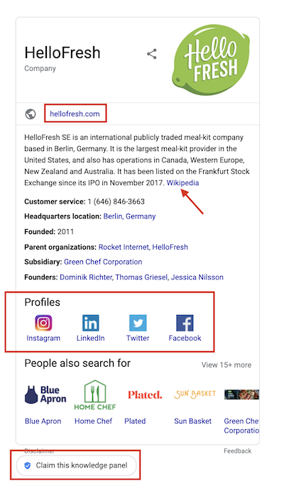
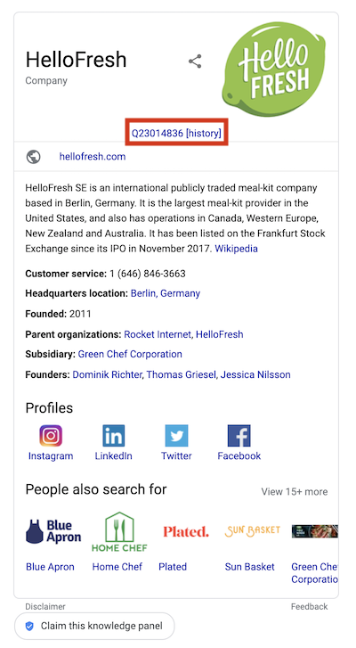

# wiki-slurpee
Browser extension for slurping Google knowledge graph data into Wikidata

**Warning: You should check all edits this extension produces. Google's data isn't perfect and nor is this extension. Major changes to Google's search results page will break this extension.**

Currently this extension can upload the following pieces of data to wikidata:

* Facebook id
* Twitter id
* Instagram id
* Freebase id
* Youtube channel id
* Pinterest id
* Soundcloud id
* Google knowledge base id
* IMDB id
* Website URL

## Usage
To use this extension you should be logged in to wikidata.

1. Find a google search result page with a knowledge box that links to a Wikipedia article.

    
    
2. Click the "slurp" button. This will attempt to upload Google's data to wikidata. If there is a data conflict then property is not updated.
3. If the edits were successful then it shows you a link to the wikidata item and its history.

    